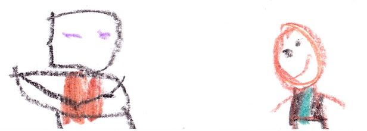
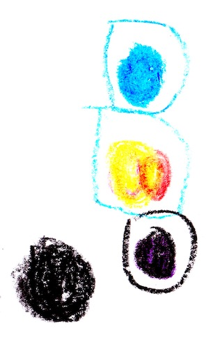

# Should I be good?

It was night and all of Herobrine's endermen were gone. The meeting was over, so an enderman took the map and brought it to me. 

{width=250px}
 

I was starving. The enderman gave me 16 cakes, and I ate three of them. The enderman also gave me the map. I said, “Thanks, but I thought you were bad.”

The enderman said, “I want to be a better enderman, and, by the way, my name is Malek."

{width=500px}
 

***In Herobrine’s base...***

“The map!” Herobrine yelled when he discovered his map was missing. 

***1 hour later...***

Everyone was there to talk about their plan. Herobrine said, 

"Elder, get the water gem!"

"Will, get the fire gem!"

"Endy, get the teleportation gem!"

"Cindy, get the night crystal!"

"And I’ll get the command block. We need all of these to rule the world!”

{width=200px}

