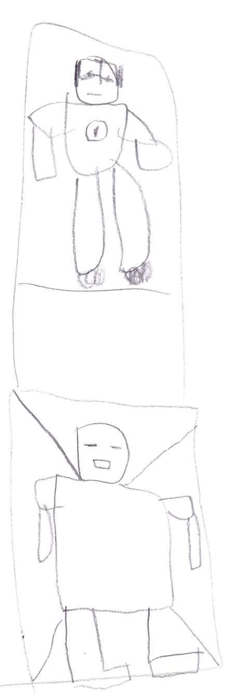
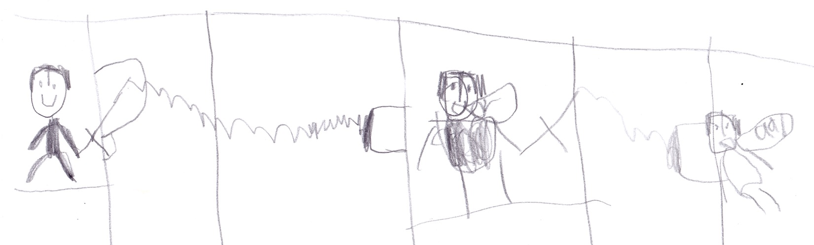

# Herobrine’s Lightning

***In the end...***

The enderman were mining when an enderman found a dark energy crystal. They brought it to Herobrine and he was so pleased. He had all he wanted to make him super powerful, so he did. He got two new superpowers. One of them was dark lightning, the other was teleportation punch.

{width=100px}

***At My Base...***

“Bob, how’s the armor coming?” I said.

“Good,” Bob said. 

A portal opened and Herobrine came out. 

I said, “Ready, Go!” I put on the armor that Bob was making, and then my whole team went out to fight Herobrine. 

{width=600px}

Malek and Bob and Felix finished the battle. I had a big scar on my face. I couldn't get out to battle for a while. 

While I was recovering, Felix led the team. One day Herobrine captured everyone but me. I couldn’t battle, but my friends needed me so I got my sword and went to battle anyway. I eventually won and freed my friends so I was back on the team. 

One day I went to the mineshaft, and I never came back down there. I found stacks of stuff. When I found a secret entrance inside there were tons of creepers. I said,

“Could it be? No way!”
