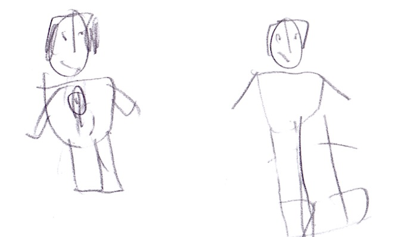

# Alex to the Rescue

All of us are hurt then someone came out and saved us. 

Alex said, “Call me Alex.”

Alex built a house and got us back on our feet. 

Unfortunately, the explosion destroyed the undetectable lair. While we were recovering from the blast, Herobrine got all of the crystals. 

He said, “Yes, yes.”

{width=400px}

***Back at Our New Base...***

Herobrine teleported to us as he transformed himself into the most deadliest monster ever. He was invincible except for his eyes. If you touch one of Herobrine’s eyes then all the magic goes out of him. If you touch both of Herobrine’s eyes then he will die.  

Then a portal opened and all of the generals came out. 

{width=600px}

I said, “Let’s fight!”

Felix tried to punch Elder, but Felix was burned by Elder’s laser eyes. 

Malek tried to teleport to Herobrine, but Herobrine was too powerful. “Odd,” Malek said. 

Herobrine said, “All of the magic is mine. Ha, ha, ha.”
